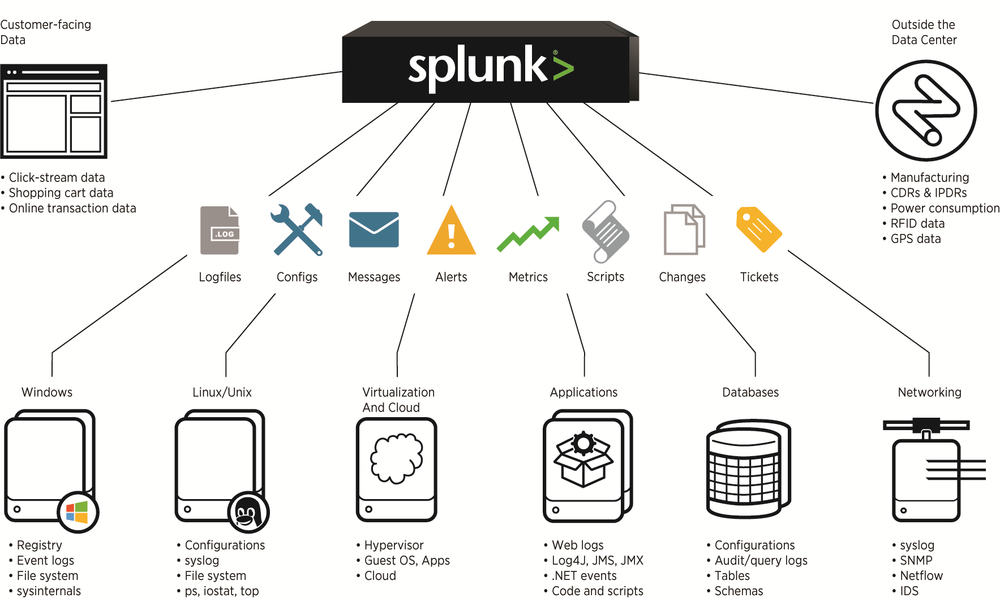
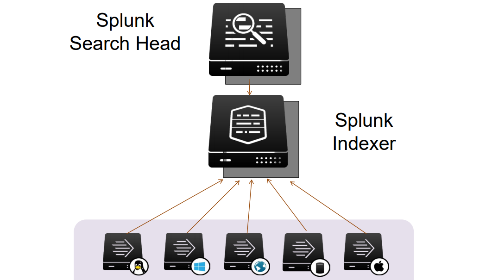

# Projektarbeit
### Mit Splunk einen Security Incident bearbeiten
---
## Inhalt
---
## Einleitung
* Projektbeschreibung
* Projektziel
  * Richtziel
  * Endergebnisse
  * Erfolgskriterien
* zusammengefasst aus: [Projektauftrag](https://www.dropbox.com/s/yvdk3uvz6mm6o99/Projektbeschreibung.pdf?dl=0)
---
## Splunk als SIEM
* Was ist ein "SIEM"?
* Splunk ist vor allem ein Produkt, aber auch ein Unternehmen
  * Enterprise
  * Light
  * Free
  * Cloud
  * Enterprise Security
  * ....
+++
### Splunk-Prozess

+++
### Masken und Widgets

+++
### eine mögliche Splunk-Umgebung

+++
### Wie arbeitet Splunk?
 
<br>
---
## Das Projekt.....
* Fragensammlung -> Capture the flag
* 32 Fragen wie: 
```Bash
What is the likely IP address of someone from the 
Po1s0n1vy group scanning imreallynotbatman.com for 
web application vulnerabilities?
```
* [Zugang auf Zielsystem](https://splunk.stoerchl.ch:8000/de-DE/account/login?return_to=%2Fde-DE%2F)
* [Splunk-Dokumentation](https://docs.splunk.com/Documentation/Splunk) 
* Fragen sind mit Punkten quantifiziert -> wenig Punkte -> leichter zu beantworten....
---
## Resultat
* Projektbeschreibung fristgerecht &#10004;
* Es wurden 11 von 32 Fragen beantwortet &#10004;
* Write-Up als [Blog](https://jaeflo.github.io/2018/analyse-securityincident-with-splunk/) &#10004;
* Pr&auml;sentation fristgerecht &#10004;
* Kompetenzkarten fristgerecht &#10004;